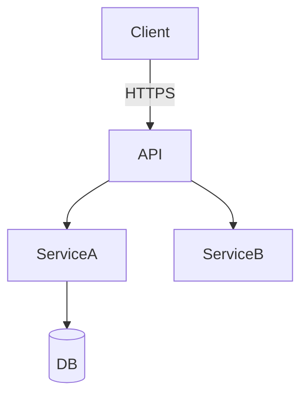

# Design

## Architecture

How does this feature fit into the system? Show the main components, their responsibilities, and how they connect.

| Component | Responsibility | Tech |
| --------- | -------------- | ---- |
|           |                |      |

## Data Models

What data does this feature manage?

- Core entities with key fields and types
- Relationships between entities (1:1, 1:N, M:N)
- Data flow: where data enters, transforms, and persists

## Interfaces

How do components communicate?

**External APIs** (if this feature exposes endpoints):

| Method | Path | Purpose | Auth |
| ------ | ---- | ------- | ---- |
|        |      |         |      |

**Internal interfaces** between modules (function signatures, events, messages).

## Design Decisions

Key decisions that shape implementation. Each row = one decision the LLM must respect.

| Decision | Choice | Trade-offs / Why |
| -------- | ------ | ---------------- |
|          |        |                  |

## Constraints

Technical, performance, or business constraints specific to this feature.

| Constraint | Target    | Rationale |
| ---------- | --------- | --------- |
|            |           |           |

## Avoid

Anti-patterns and wrong approaches for this feature. What NOT to do and why.

- ...
