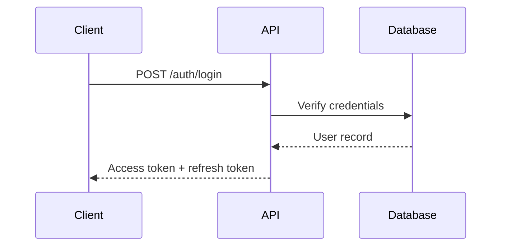

# API

## Changelog

| Date       | Action  | Summary          |
| ---------- | ------- | ---------------- |
| YYYY-MM-DD | Created | Initial creation |

## API Strategy

| Item           | Value                          |
| -------------- | ------------------------------ |
| Style          | REST / GraphQL / tRPC          |
| Base URL       | `/api/v1`                      |
| Auth           | JWT / Session / API Key        |
| Documentation  | Swagger / OpenAPI / none       |

## Authentication

- Auth flow overview (login, token refresh, logout)
- Token format and storage strategy
- Role-based access control (if applicable)



## Response Format

```json
{
  "success": true,
  "data": {},
  "error": null,
  "meta": {
    "page": 1,
    "limit": 20,
    "total": 100
  }
}
```

## Error Format

```json
{
  "success": false,
  "data": null,
  "error": {
    "code": "VALIDATION_ERROR",
    "message": "Human-readable message",
    "details": []
  }
}
```

## Endpoints Overview

### Auth

| Method | Path           | Description       | Auth     |
| ------ | -------------- | ----------------- | -------- |
| POST   | /auth/login    | User login        | Public   |
| POST   | /auth/register | User registration | Public   |
| POST   | /auth/refresh  | Refresh token     | Required |

### Resources

| Method | Path              | Description       | Auth     |
| ------ | ----------------- | ----------------- | -------- |
| GET    | /resources        | List resources    | Required |
| GET    | /resources/:id    | Get resource      | Required |
| POST   | /resources        | Create resource   | Required |
| PUT    | /resources/:id    | Update resource   | Required |
| DELETE | /resources/:id    | Delete resource   | Required |

## Conventions

- Naming: kebab-case for URLs, camelCase for JSON fields
- Pagination: cursor-based or offset-based (specify which)
- Filtering: query params (`?status=active&sort=-created_at`)
- Rate limiting: requests per minute per user/IP
- Versioning: URL prefix (`/api/v1/`)

## Validation

- Input validation approach (Zod / Joi / class-validator)
- Common validation patterns
- File upload limits and allowed types

## Related Documents

| Document                            | Description                            |
| ----------------------------------- | -------------------------------------- |
| [Overview](./overview.md)           | Project concept & documentation index  |
| [Architecture](./architecture.md)   | Tech stack & folder structure          |
| [Design System](./design-system.md) | UI/UX language & component style       |
| [Database](./database.md)           | Schema & relationships                 |
| [Roadmap](./roadmap.md)             | Versions & milestones                  |
