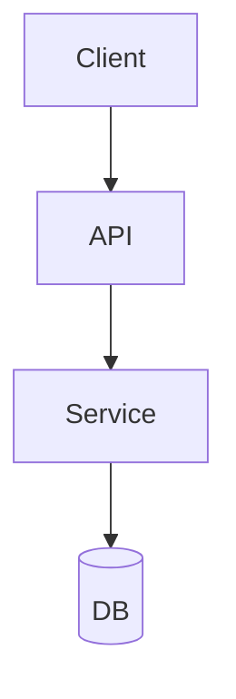

# Architecture

## Changelog

| Date       | Action  | Summary          |
| ---------- | ------- | ---------------- |
| YYYY-MM-DD | Created | Initial creation |

## Tech Stack

| Layer     | Technology | Version | Purpose          |
| --------- | ---------- | ------- | ---------------- |
| Frontend  | -          | -       | -                |
| Backend   | -          | -       | -                |
| Database  | -          | -       | -                |
| Hosting   | -          | -       | -                |
| CI/CD     | -          | -       | -                |

## System Architecture



## Folder Structure

```
project-root/
├── src/
│   ├── ...
├── docs/
│   ├── overview.md
│   ├── architecture.md
│   ├── design-system.md
│   ├── database.md
│   ├── api.md
│   └── roadmap.md
└── ...
```

## Key Patterns

| Pattern            | Where Applied | Purpose          |
| ------------------ | ------------- | ---------------- |
| Pattern name       | Module/layer  | Why it's used    |

## Infrastructure

- Hosting and deployment strategy
- Environment configuration (dev, staging, production)
- CI/CD pipeline overview

## Dependencies

### Core

| Package | Version | Purpose |
| ------- | ------- | ------- |
| -       | -       | -       |

### Dev

| Package | Version | Purpose |
| ------- | ------- | ------- |
| -       | -       | -       |

## Related Documents

| Document                                 | Description                            |
| ---------------------------------------- | -------------------------------------- |
| [Overview](./overview.md)                | Project concept & documentation index  |
| [Design System](./design-system.md)      | UI/UX language & component style       |
| [Database](./database.md)                | Schema & relationships                 |
| [API](./api.md)                          | Endpoints & conventions                |
| [Roadmap](./roadmap.md)                  | Versions & milestones                  |
