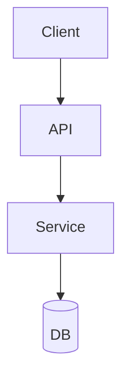

# Architecture

## Tech Stack

| Layer    | Technology | Purpose |
| -------- | ---------- | ------- |
| Frontend | -          | -       |
| Backend  | -          | -       |
| Database | -          | -       |
| Hosting  | -          | -       |

## System Overview


```mermaid
graph TD
    Client --> API
    API --> Service
    Service --> Database[(DB)]
```

## Folder Structure

```
project-root/
├── src/
│   ├── ...
├── docs/
└── ...
```

## Key Patterns

Patterns that the LLM should follow when generating code in this project.

| Pattern | Where | Why |
| ------- | ----- | --- |
|         |       |     |
