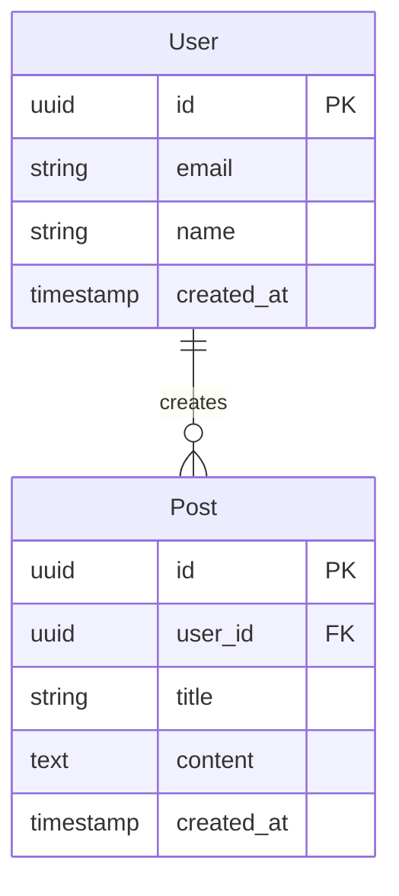

# Database

## Changelog

| Date       | Action  | Summary          |
| ---------- | ------- | ---------------- |
| YYYY-MM-DD | Created | Initial creation |

## Database Strategy

| Item     | Value                         |
| -------- | ----------------------------- |
| Engine   | PostgreSQL / SQLite / MongoDB |
| ORM      | Prisma / Drizzle / TypeORM    |
| Hosting  | Supabase / PlanetScale / etc  |
| Migration| Tool and strategy             |

## Entity Relationship Diagram

## Tables / Collections

### User

| Column     | Type      | Constraints      | Description       |
| ---------- | --------- | ---------------- | ----------------- |
| id         | uuid      | PK, auto         | Primary key       |
| email      | varchar   | unique, not null | User email        |
| name       | varchar   | not null         | Display name      |
| created_at | timestamp | default now()    | Creation time     |

### (Additional tables follow same format)

## Indexes

| Table | Index Name    | Columns  | Type   | Purpose            |
| ----- | ------------- | -------- | ------ | ------------------ |
| User  | idx_user_email| email    | unique | Email lookup       |

## Relationships

| From  | To    | Type     | FK Column | On Delete |
| ----- | ----- | -------- | --------- | --------- |
| Post  | User  | many-to-1| user_id   | cascade   |

## Migration Strategy

- Migration tool and workflow
- Seed data approach
- Rollback strategy

## Data Policies

- Soft delete vs hard delete
- Audit logging approach
- Data retention and cleanup

## Related Documents

| Document                            | Description                            |
| ----------------------------------- | -------------------------------------- |
| [Overview](./overview.md)           | Project concept & documentation index  |
| [Architecture](./architecture.md)   | Tech stack & folder structure          |
| [Design System](./design-system.md) | UI/UX language & component style       |
| [API](./api.md)                     | Endpoints & conventions                |
| [Roadmap](./roadmap.md)             | Versions & milestones                  |
