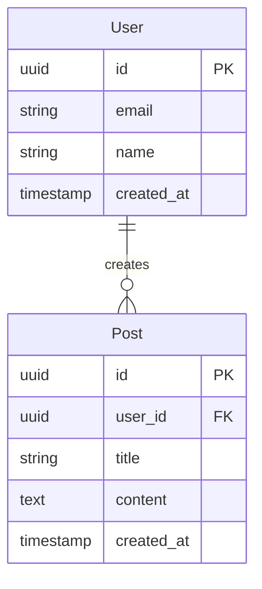

# Database

## Strategy

| Item   | Value                         |
| ------ | ----------------------------- |
| Engine | PostgreSQL / SQLite / MongoDB |
| ORM    | Prisma / Drizzle / TypeORM    |

## Entity Relationship Diagram

```mermaid
erDiagram
    User ||--o{ Post : creates
    User {
        uuid id PK
        string email
        string name
        timestamp created_at
    }
    Post {
        uuid id PK
        uuid user_id FK
        string title
        text content
        timestamp created_at
    }
```

## Tables

> Only project-wide/shared tables here. Feature-specific tables are documented in feature docs.

### User

| Column     | Type      | Constraints      | Description  |
| ---------- | --------- | ---------------- | ------------ |
| id         | uuid      | PK, auto         | Primary key  |
| email      | varchar   | unique, not null | User email   |
| name       | varchar   | not null         | Display name |
| created_at | timestamp | default now()    | Created at   |

### (Additional tables follow same format)

## Relationships

| From | To   | Type      | FK Column | On Delete |
| ---- | ---- | --------- | --------- | --------- |
| Post | User | many-to-1 | user_id   | cascade   |
