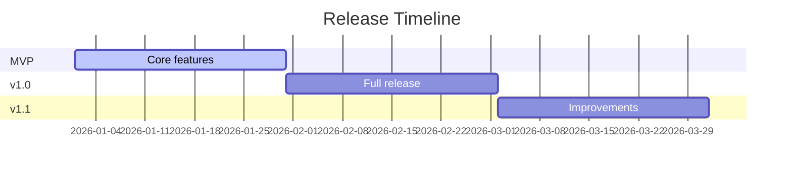

# Roadmap

## Changelog

| Date       | Action  | Summary          |
| ---------- | ------- | ---------------- |
| YYYY-MM-DD | Created | Initial creation |

## Vision

One sentence describing where this product is heading long-term.

## Release Timeline

## MVP

**Goal:** Ship the minimum viable product as fast as possible.

**Target:** YYYY-MM-DD

| Feature           | Priority | Status      |
| ----------------- | -------- | ----------- |
| Core feature 1    | Must     | Not started |
| Core feature 2    | Must     | Not started |
| Core feature 3    | Must     | Not started |

**Ship criteria:**
- What must work before MVP ships
- Acceptable trade-offs and known limitations

## v1.0

**Goal:** Complete, polished first release.

**Target:** YYYY-MM-DD

| Feature              | Priority | Status      |
| -------------------- | -------- | ----------- |
| Feature from MVP+    | Must     | Not started |
| Polish / UX          | Should   | Not started |
| Additional feature   | Should   | Not started |

## v1.1+

**Goal:** Iteration based on user feedback.

| Feature              | Priority | Status      |
| -------------------- | -------- | ----------- |
| Feedback-driven item | Could    | Not started |
| Performance work     | Could    | Not started |
| Nice-to-have         | Won't    | Not started |

## Backlog

Items considered but not scheduled:

- Idea 1
- Idea 2
- Idea 3

## Priority Legend

| Priority | Meaning                          |
| -------- | -------------------------------- |
| Must     | Required for this release        |
| Should   | Important but not blocking ship  |
| Could    | Nice to have if time permits     |
| Won't    | Explicitly deferred              |

## Related Documents

| Document                            | Description                            |
| ----------------------------------- | -------------------------------------- |
| [Overview](./overview.md)           | Project concept & documentation index  |
| [Architecture](./architecture.md)   | Tech stack & folder structure          |
| [Design System](./design-system.md) | UI/UX language & component style       |
| [Database](./database.md)           | Schema & relationships                 |
| [API](./api.md)                     | Endpoints & conventions                |
