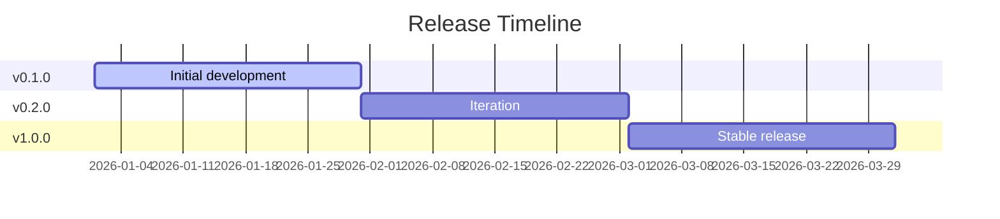

# Roadmap

> **Live feature status** is tracked in [`VERSION.md`](../VERSION.md) at the project root. This roadmap defines high-level goals and milestones per version.

## Changelog

| Date       | Action  | Summary          |
| ---------- | ------- | ---------------- |
| YYYY-MM-DD | Created | Initial creation |

## Vision

One sentence describing where this product is heading long-term.

## Release Timeline

## v0.1.0

**Goal:** Ship the initial working version as fast as possible.

**Target:** YYYY-MM-DD

| Feature        | Priority |
| -------------- | -------- |
| Core feature 1 | Must     |
| Core feature 2 | Must     |
| Core feature 3 | Must     |

**Ship criteria:**

- What must work before this version ships
- Acceptable trade-offs and known limitations

## v0.2.0

**Goal:** Iterate based on early feedback.

**Target:** YYYY-MM-DD

| Feature              | Priority |
| -------------------- | -------- |
| Feedback-driven item | Must     |
| Polish / UX          | Should   |
| Additional feature   | Should   |

## v1.0.0

**Goal:** First stable release.

**Target:** YYYY-MM-DD

| Feature            | Priority |
| ------------------ | -------- |
| Stability / polish | Must     |
| Performance work   | Should   |
| Nice-to-have       | Could    |

## Backlog

Items considered but not scheduled:

- Idea 1
- Idea 2
- Idea 3

## Priority Legend

| Priority | Meaning                         |
| -------- | ------------------------------- |
| Must     | Required for this release       |
| Should   | Important but not blocking ship |
| Could    | Nice to have if time permits    |
| Won't    | Explicitly deferred             |

## SemVer Reference

| Bump  | When                                | Example         |
| ----- | ----------------------------------- | --------------- |
| PATCH | Bug fixes, docs, no new features    | v1.0.0 → v1.0.1 |
| MINOR | New features, backward-compatible   | v1.0.0 → v1.1.0 |
| MAJOR | Breaking changes or major milestone | v0.2.0 → v1.0.0 |

`v0.x.x` = initial development (pre-stable). `v1.0.0` = first stable release.

## Related Documents

| Document                            | Description                           |
| ----------------------------------- | ------------------------------------- |
| [VERSION.md](../VERSION.md)         | Live feature status & release history |
| [Overview](./overview.md)           | Project concept & documentation index |
| [Architecture](./architecture.md)   | Tech stack & folder structure         |
| [Design System](./design-system.md) | UI/UX language & component style      |
| [Database](./database.md)           | Schema & relationships                |
| [API](./api.md)                     | Endpoints & conventions               |
