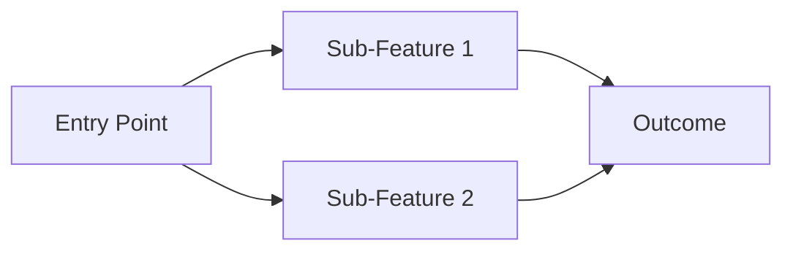

# {Feature Name} — Feature Overview

## Changelog

| Date       | Author | Action  | Summary          |
| ---------- | ------ | ------- | ---------------- |
| YYYY-MM-DD | Author | Created | Initial creation |

## Summary

**What is this feature?**

- Brief description of the feature
- Why it exists and what value it delivers

## Sub-Features

**What are the major parts?**

| Sub-Feature   | Description       | Status                           |
| ------------- | ----------------- | -------------------------------- |
| sub-feature-1 | Brief description | Not started / In progress / Done |
| sub-feature-2 | Brief description | Not started / In progress / Done |

## Scope & Boundaries

**What's included and what's not?**

- In scope
- Out of scope
- Future considerations

## User Flows

**How does the user move through this feature?**



## Dependencies

**What does this feature depend on?**

- Internal dependencies (other features, modules)
- External dependencies (APIs, services)
- Shared components / utilities

## Documentation Map

**Where to find detailed docs:**

```
docs/feature/{feature-name}/
├── README.md                              ← You are here
├── requirements.md                        ← High-level requirements
├── design.md                              ← Overall architecture
│
├── {sub-feature-1}/
│   ├── requirements.md
│   ├── design.md
│   ├── implementation.md
│   └── testing.md
│
└── {sub-feature-2}/
    ├── requirements.md
    ├── design.md
    ├── implementation.md
    └── testing.md
```
