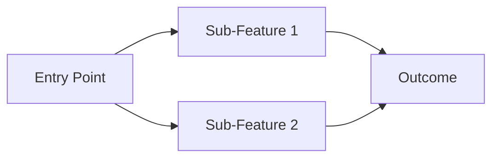
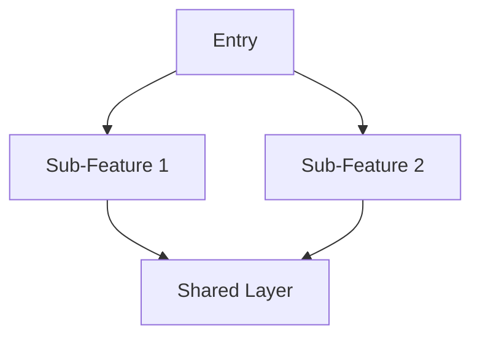

# {Feature Name} — Overview

## Changelog

| Date       | Author | Action  | Summary          |
| ---------- | ------ | ------- | ---------------- |
| YYYY-MM-DD | Author | Created | Initial creation |

## Summary

- Brief description of the feature
- Why it exists and what value it delivers

## Sub-Features

| Sub-Feature   | Description       | Status                           |
| ------------- | ----------------- | -------------------------------- |
| sub-feature-1 | Brief description | Not started / In progress / Done |
| sub-feature-2 | Brief description | Not started / In progress / Done |

## Scope & Boundaries

**In scope:**

- ...

**Out of scope:**

- ...

**Future considerations:**

- ...

## User Flows



## Shared Architecture

High-level overview of how sub-features connect. No implementation details — those live in sub-feature docs.



| Decision                   | Choice          | Rationale |
| -------------------------- | --------------- | --------- |
| Key architectural decision | What was chosen | Why       |

## Shared Constraints

**Technical:**

- Tech stack, platform constraints
- Shared dependencies (APIs, modules, models)

**Performance:**

| Metric     | Target       |
| ---------- | ------------ |
| Key metric | Target value |

**Security / Accessibility:**

- Brief shared NFRs that apply to all sub-features

## Open Questions

- Unresolved items requiring stakeholder input

## Documentation Map

```
docs/features/{feature-name}/
├── README.md                              ← You are here (overview + scope + shared architecture)
│
├── {sub-feature-1}/
│   ├── requirements.md
│   ├── design.md
│   ├── implementation.md
│   └── testing.md
│
└── {sub-feature-2}/
    ├── requirements.md
    ├── design.md
    ├── implementation.md
    └── testing.md
```
