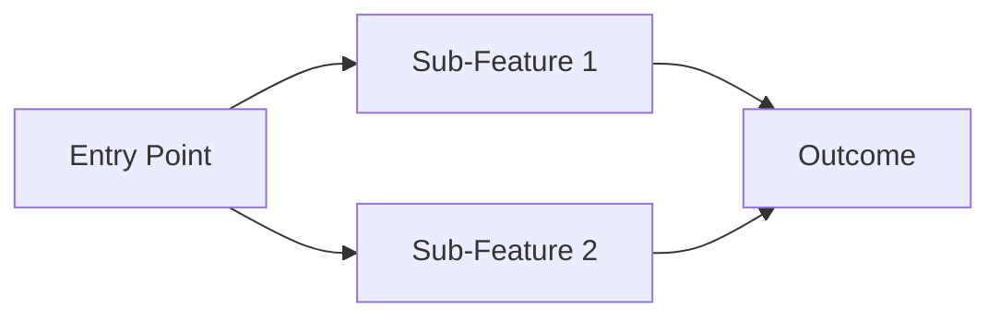

# {Feature Name} — Overview

## Summary

What does this feature do, and why does it exist?

- Core capability in one sentence
- Who uses it and what value they get
- How it fits into the broader product

## Sub-Features

| Sub-Feature   | Description       | Status                           |
| ------------- | ----------------- | -------------------------------- |
| sub-feature-1 | Brief description | Not started / In progress / Done |

## Scope

**In scope:**

- Capabilities this feature will deliver

**Out of scope:**

- What this feature explicitly will NOT do (prevents scope creep)

## User Flows

How users move through the feature. Update the diagram to reflect actual entry points, decision branches, and outcomes.

```mermaid
graph LR
    A[Entry Point] --> B[Sub-Feature 1]
    A --> C[Sub-Feature 2]
    B --> D[Outcome]
    C --> D
```
