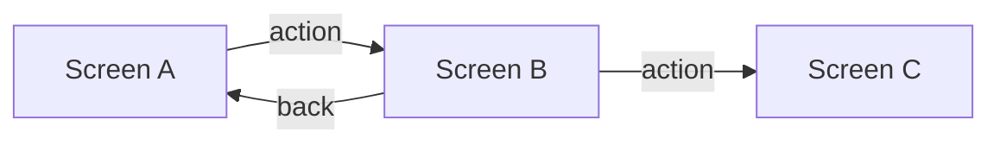

# UI Design

> Only create this doc for features with a user interface. Reference `docs/design-system.md` for project-wide tokens, colors, typography, and component patterns.

## Screen / Page Index

| Screen       | Route / Path | Purpose            |
| ------------ | ------------ | ------------------ |
| Screen Name  | /path        | What the user does |

## Layouts

For each key screen, define the layout structure using ASCII wireframes. Annotate with Tailwind classes so the LLM can translate directly to code.

### {Screen Name}

**Layout:** `flex flex-col min-h-screen`

```
┌─────────────────────────────────────────────────────┐
│  nav: flex items-center justify-between px-6 h-16   │
├─────────────────────────────────────────────────────┤
│                                                     │
│  main: max-w-4xl mx-auto px-4 py-8                  │
│                                                     │
│  ┌─────────┐  ┌─────────┐  ┌─────────┐             │
│  │ Card    │  │ Card    │  │ Card    │              │
│  │ p-6     │  │ p-6     │  │ p-6     │              │
│  └─────────┘  └─────────┘  └─────────┘             │
│  grid grid-cols-3 gap-6                              │
│                                                     │
├─────────────────────────────────────────────────────┤
│  footer: text-sm text-muted py-4 text-center        │
└─────────────────────────────────────────────────────┘
```

**Responsive breakpoints:**

- `sm`: stack to single column (`grid-cols-1`)
- `lg`: 3-column grid as shown

**States:** default, loading (skeleton), empty (no data message), error (inline alert)

### {Screen Name 2}

(Repeat pattern above for each key screen)

## Screen Flow

How users navigate between screens. Update to match actual routes and transitions.



## Animations

Only list animations that serve a purpose (communicate state change, guide attention, provide feedback). Reference design-system motion tokens.

| Trigger          | Element      | Animation                           | Tailwind / CSS                              |
| ---------------- | ------------ | ----------------------------------- | ------------------------------------------- |
| Page load        | Card grid    | Stagger fade-in from bottom         | `animate-in fade-in slide-in-from-bottom-4` |
| Hover            | Card         | Subtle lift                         | `hover:-translate-y-1 transition-transform`  |
| State change     | Status badge | Color transition                    | `transition-colors duration-200`             |

## Avoid

- Over-animating — if the user doesn't notice the animation consciously, it's working
- Layout shifts after content loads (use skeletons matching final dimensions)
- Custom scrollbars, decorative dividers, or anything that doesn't serve the user's task
