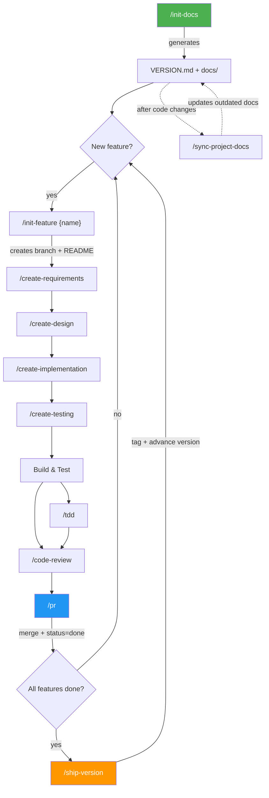
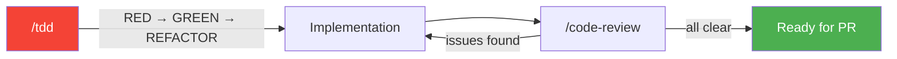
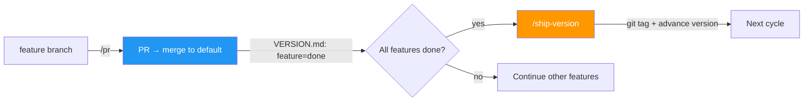

# everything-cursor

A batteries-included `.cursor` configuration for AI-assisted development. Provides structured commands, rules, agents, skills, and templates to enforce consistent workflows across any project.

## Setup

```bash
git clone https://github.com/dam2onkid/everything-cursor.git
cd everything-cursor
./setup.sh /path/to/your-project
```

The `setup.sh` script auto-discovers all files under `.cursor/` and copies them into the target project (creating it if needed). No hardcoded file lists — any new rules, commands, or templates you add are picked up automatically.

### Options

| Flag                      | Description                                   |
| ------------------------- | --------------------------------------------- |
| `-f, --force`             | Overwrite existing files without prompting    |
| `-b, --backup`            | Backup existing `.cursor/` before overwriting |
| `-d, --dry-run`           | Preview what would be copied                  |
| `-e, --exclude <pattern>` | Exclude matching paths (repeatable)           |
| `-i, --include <pattern>` | Copy only matching paths (repeatable)         |

### Examples

```bash
./setup.sh ~/projects/my-app                                        # copy everything
./setup.sh --dry-run ~/projects/my-app                              # preview first
./setup.sh --backup --force ~/projects/my-app                       # backup then overwrite
./setup.sh --exclude "rules/typescript" ~/projects/my-app           # skip TS rules
./setup.sh --include "rules/common" --include "commands" ~/my-app   # only common rules + commands
```

Open your project in Cursor and the rules, commands, and agents are ready to use.

## What's Included

```
.cursor/
├── commands/          # Slash commands for Cursor chat
├── rules/
│   ├── common/        # Language-agnostic rules (always applied)
│   └── typescript/    # TypeScript-specific rules (applied to .ts/.tsx/.js/.jsx)
├── agents/            # Specialized AI agents
├── scripts/           # Cross-platform helper scripts used by commands
├── skills/            # Reusable multi-mode skills
└── templates/         # Document templates used by commands
```

## Commands

Run these in Cursor chat with `/command-name`.

| Command                  | Description                                                                     |
| ------------------------ | ------------------------------------------------------------------------------- |
| `/init-docs`             | Initialize project docs + `VERSION.md` from codebase analysis                   |
| `/sync-project-docs`     | Detect drift between docs/VERSION.md and code, update outdated sections         |
| `/init-feature`          | Initialize a feature with overview doc + `feat/{version}/{name}` branch         |
| `/create-requirements`   | Create a requirements document for a feature or sub-feature                     |
| `/create-design`         | Create a system design & architecture document                                  |
| `/create-implementation` | Create an implementation plan document                                          |
| `/create-testing`        | Create a testing strategy document                                              |
| `/update-feature-docs`   | Update an existing feature doc and add a changelog entry                        |
| `/code-review`           | Run a comprehensive security and quality review on uncommitted changes          |
| `/run-tests`             | Run all tests, curl API endpoints, save results, and auto-fix failures          |
| `/tdd`                   | Start a TDD session — scaffolds interfaces, writes tests first, then implements |
| `/pr`                    | Sync docs, commit, push, and open a PR targeting the default branch             |
| `/ship-version`          | Tag current version (SemVer), advance VERSION.md to next version                |

## Workflows

### Full Lifecycle Overview



---

### Step 1 — Initialize Project Docs

Run once at project start. Analyzes your codebase and generates `VERSION.md` + 6 project-level docs.

```
/init-docs
```

Output:

```
VERSION.md               ← current version, feature statuses, release history
docs/
├── overview.md          ← project index (AI reads this first)
├── architecture.md      ← tech stack, folder structure, patterns
├── design-system.md     ← colors, typography, spacing, components
├── database.md          ← ERD, tables, indexes, relationships
├── api.md               ← endpoints, auth, response format
└── roadmap.md           ← versions, milestones, priorities
```

Keep docs in sync after code changes:

```
/sync-project-docs
```

Detects drift between docs and code, updates outdated sections, preserves user-written prose, and adds changelog entries. The `docs-context` rule ensures the AI reads `docs/overview.md` first before any task — progressive disclosure to reduce context waste.

---

### Step 2 — Plan a Feature

Feature doc paths use the **major version** only (`v0`, `v1`, `v2`), extracted from the current SemVer in `VERSION.md`.


**2a. Initialize feature** — creates branch, README, and VERSION.md entry:

```
/init-feature {name}
```

What happens:
- Creates `docs/features/v{MAJOR}/{name}/README.md`
- Switches to `feat/{version}/{name}` branch (from default branch)
- Adds feature to `VERSION.md` with `not-started` status
- If feature existed in a prior major version, references old docs

**2b. Create docs** — run each command in order, providing detailed context:

```
/create-requirements {name}     ← problem, goals, user stories, success criteria
/create-design {name}           ← architecture, data models, design decisions
/create-implementation {name}   ← task breakdown, phases, approach
/create-testing {name}          ← test scenarios, coverage plan, edge cases
```

> **Tip**: The more context you provide, the better the output. Don't just pass a name — describe **what the feature does, who it's for, and any constraints**. See [Examples](#examples) below.

---

### Step 3 — Build & Test

Use `/tdd` for test-driven development and `/code-review` for quality checks.



**TDD session** — scaffolds interfaces, writes tests first, then implements:

```
/tdd
I need a function to validate Vietnamese phone numbers.
- Accept 10-digit format: 0xx-xxx-xxxx
- Support all carriers: Viettel (032-039), Mobifone (070-079), Vinaphone (081-089)
- Return { valid: boolean, carrier: string | null, normalized: string }
- Throw on non-string input
```

**Code review** — no arguments needed, automatically reviews all uncommitted changes:

```
/code-review
```

Checks security (credentials, injection, XSS, validation), code quality (line limits, nesting, error handling), and blocks commit on CRITICAL/HIGH issues.

---

### Step 4 — PR & Ship



**Create PR** — syncs all docs, commits, pushes, and opens a PR:

```
/pr
```

What happens:
1. Syncs project docs (if `docs/overview.md` exists)
2. Syncs feature docs (if matching feature directory exists)
3. Sets feature status to `done` in `VERSION.md`
4. Commits doc changes, pushes, and creates PR targeting the default branch

**Ship a version** — after all features in the current version are `done`:

```
/ship-version
```

What happens:
1. Validates all features are `done`
2. Creates an annotated git tag (e.g., `v0.1.0`)
3. Auto-suggests the next SemVer bump
4. Advances `VERSION.md` to the next version

All versions follow SemVer (`vMAJOR.MINOR.PATCH`). Initial development starts at `v0.1.0`.

---

### Updating Existing Docs

```
/update-feature-docs {name}
<describe what changed and why>
```

Prompts you for which doc type to update. Automatically adds a changelog entry. Old content is replaced (not appended) — the changelog serves as the historical record.

---

### Examples

#### Simple feature

```
/init-feature search

/create-requirements search
Full-text and semantic search for marketplace listings.
- Users can search by title, description, tags, and seller name
- Results ranked by relevance with optional filters (price range, category, date)
- Must support Vietnamese diacritics and fuzzy matching
- Target: <200ms response time for 500k listings

/create-design search
/create-implementation search
/create-testing search
```

Output (given current version `v0.1.0`, major = `v0`):

```
docs/features/v0/search/
├── README.md
├── requirements.md
├── design.md
├── implementation.md
└── testing.md
```

#### Complex feature with sub-features

```
/init-feature listing
<list all sub-features and their purposes>

/create-requirements listing/filter
<detailed filter requirements, user stories, edge cases...>

/create-design listing/filter
/create-implementation listing/filter
/create-testing listing/filter
```

Output:

```
docs/features/v0/listing/
├── README.md              ← parent overview (from init-feature)
└── filter/
    ├── requirements.md
    ├── design.md
    ├── implementation.md
    └── testing.md
```

#### End-to-end: from zero to shipped

```
/init-docs                              ← 1. project docs
/init-feature auth                      ← 2. start feature
/create-requirements auth               ← 3. plan
/create-design auth
/create-implementation auth
/create-testing auth
/tdd                                    ← 4. build (test-first)
/code-review                            ← 5. review
/pr                                     ← 6. merge
/ship-version                           ← 7. tag & release
```

## Skills

Skills are reusable, multi-mode capabilities that combine multiple commands into a single workflow.

| Skill                 | Description                                                                   |
| --------------------- | ----------------------------------------------------------------------------- |
| **agent-md-refactor** | Create, sync, and refactor project docs and agent instruction files (3 modes) |

The `agent-md-refactor` skill supports three modes:

- **Create** — analyze codebase and generate all 6 project-level docs
- **Sync** — detect drift between docs and code, update outdated sections
- **Refactor** — split bloated agent instruction files (AGENTS.md, CLAUDE.md) into progressive disclosure structure

## Agents

| Agent                 | Description                                                   | When to use                                                |
| --------------------- | ------------------------------------------------------------- | ---------------------------------------------------------- |
| **tdd-guide**         | Enforces Red-Green-Refactor TDD cycle with 80%+ coverage      | New features, bug fixes, refactoring                       |
| **security-reviewer** | Detects OWASP Top 10, hardcoded secrets, injection, XSS, SSRF | After writing auth, API, input handling, or financial code |

## Rules (Auto-Applied)

### Common (all languages)

| Rule             | Enforces                                                                            |
| ---------------- | ----------------------------------------------------------------------------------- |
| **coding-style** | Immutability, small files (<800 lines), small functions (<50 lines), error handling |
| **docs-context** | Progressive disclosure — read `docs/overview.md` first, then navigate on demand     |
| **no-ai-slop**   | Intentional design over generic AI aesthetics — typography, color, layout, motion   |
| **pattern**      | Repository pattern, consistent API response envelope, skeleton projects             |
| **security**     | No hardcoded secrets, input validation, injection prevention, rate limiting         |
| **testing**      | 80% coverage minimum, TDD workflow, unit + integration + E2E tests                  |

### TypeScript (applied to `*.ts`, `*.tsx`, `*.js`, `*.jsx`)

| Rule             | Enforces                                                                   |
| ---------------- | -------------------------------------------------------------------------- |
| **coding-style** | Spread-based immutability, async/await error handling, Zod validation      |
| **pattern**      | `ApiResponse<T>` interface, custom hooks pattern, typed repository pattern |
| **security**     | Environment variables for secrets, startup validation, security-reviewer   |
| **testing**      | Playwright for E2E testing                                                 |

## Scripts

Scripts live in `.cursor/scripts/` and are called by commands to avoid repeating version/branch logic in every command prompt. Cross-platform: Linux, macOS, Windows (Git Bash / WSL / MSYS2).

| Script                  | Output                 | Example            |
| ----------------------- | ---------------------- | ------------------ |
| `get-version.sh`        | Full SemVer version    | `v0.1.0`           |
| `get-version.sh major`  | Major version only     | `v0`               |
| `get-docs-path.sh`      | Feature docs base path | `docs/features/v0` |
| `get-default-branch.sh` | Repo's default branch  | `main`             |

## Templates

Templates live in `.cursor/templates/` and are used automatically by the commands.

### Project-level (used by `/init-docs`)

- `docs-overview.md` — project index and quick reference
- `docs-architecture.md` — tech stack, folder structure, patterns
- `docs-design-system.md` — colors, typography, spacing, components
- `docs-database.md` — ERD, tables, indexes, relationships
- `docs-api.md` — endpoints, auth, response format
- `docs-roadmap.md` — versions, milestones, priorities (SemVer)
- `version.md` — VERSION.md file template (current version, feature statuses, releases)

### Feature-level (used by `/init-feature` and `/create-*`)

- `feature-overview.md` — parent-level feature overview
- `requirements.md` — requirements & problem understanding
- `design.md` — system design & architecture
- `ui-design.md` — visual layout, ASCII wireframes with Tailwind classes, screen flow
- `implementation.md` — implementation plan
- `testing.md` — testing strategy

## Customization

- **Add language-specific rules**: Create a new folder under `.cursor/rules/` (e.g., `python/`) with `.mdc` files
- **Add new commands**: Create `.md` files in `.cursor/commands/`
- **Add new agents**: Create `.md` files in `.cursor/agents/`
- **Add new skills**: Create a `SKILL.md` in `.cursor/skills/{skill-name}/`
- **Edit templates**: Modify files in `.cursor/templates/` to match your team's doc standards

## References

- [everything-claude-code](https://github.com/affaan-m/everything-claude-code)
